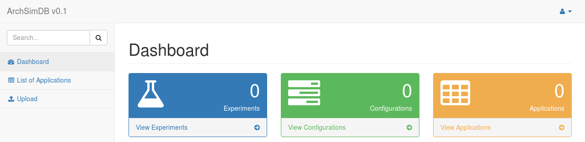
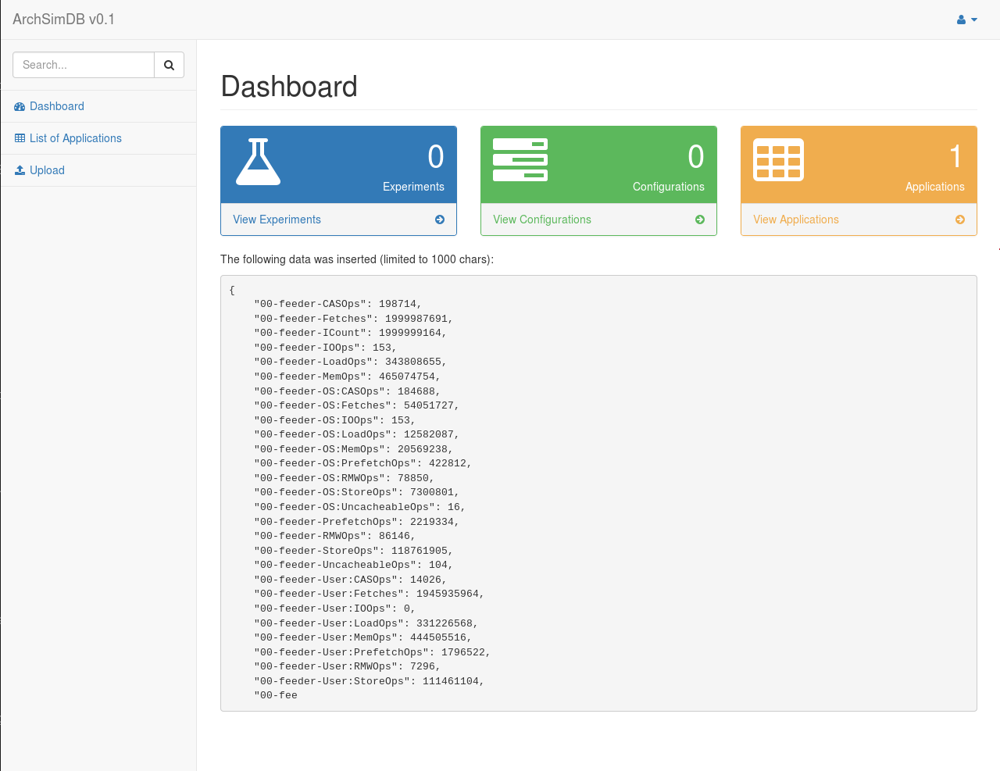
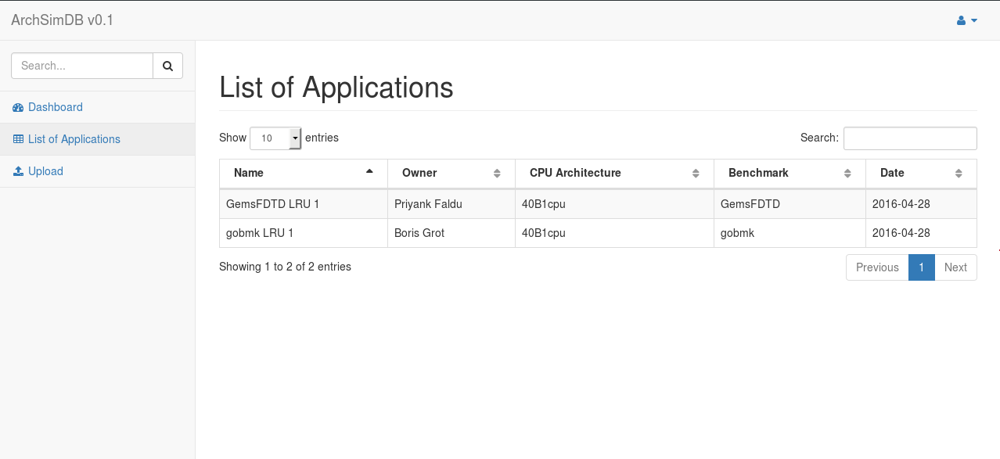

4th Year Honours Project: ArchSimDB
=====================

This is the source code for my 4th Year Honours Project. 

## Quick Start

### Pre-requisites and Preface

Before getting started, make sure that you have **MongoDB** running as this will be the database for the web app. You can do this by typing `mongod` on the terminal after installing MongoDB. These instructions are given for Linux systems only, and this software has only been tested on Linux systems.

### Setting up the Database

Once you have got a mongo shell up and running (see above), the easiest way to get ArchSimDB set up locally is to use PyMongo - a MongoDB client for Python. If you are comfortable with MongoDB for Shell, feel free to use that. Firstly, collect PyMongo via `pip`:

```
$ sudo pip3 install pymongo
```

Then launch a `python` interpreter and set up the MongoDB client as follows:

```
$ python
>>> import pymongo
>>> from pymongo import MongoClient
>>> client = MongoClient()
```

Creating a database occurs when you assign it to a variable in PyMongo, so the following creates a database and gives us access to it using the variable `db`:

```
>>> db = client.db
```

Inside our database we have three collections: `experiments`, `configurations`, and `applications`. We create these in a similar way to how we create the database, as follows:

```
>>> experiments = db.experiments
>>> configurations = db.configurations
>>> applications = db.applications
```

You have now created a database `db` with three collections `experiments`, `configurations`, and `applications`. Once this is set up, the web app should be able to insert and query the data within.

### Launching the web app

1. Clone the repository into a working directory.
2. In the `src` folder, run the command `sudo python3 setup.py develop`. This will prepare the files for Pyramid.
3. Run the command `pserve development.ini --reload` to start up the webapp. If you get any `ImportError`s, attempt to install the package with `pip`.

The webapp should now be running locally, with the default port being http://localhost:6543. Assuming you have a working copy of the database, you should see something like this:



If you have database with a different schema to ArchSimDB, you'll likely get empty data here.

## Uploading a statfile

Currently the only accepted statfiles are ones generated from the Flexus simulator. To upload a file:

1. Go to http://localhost:6543/upload, or choose the 'Upload' item from the navigation bar.
2. Fill in the required metadata fields.
3. Click on the 'Browse...' button and choose a Flexus statfile.
4. Click 'submit'
5. You should receive a confirmation page with a snippet of the inserted data in JSON format and the ObjectID, such as below.



## Querying the Database

At this stage, querying of the database is limited. Users can search through applications only, as the data structures haven't been fully set up yet. However, finding applications is easy at this stage:

1. Go to http://localhost:6543/applications, or choose the 'List of Applications' item from the navigation bar.
2. You should see a table displaying selected metadata with search and sort functionality:

   

3. Searching will return any matches from any columns live, and searching will sort based on the data type.

## Tutorial

More in-depth explanation of the system will follow.
